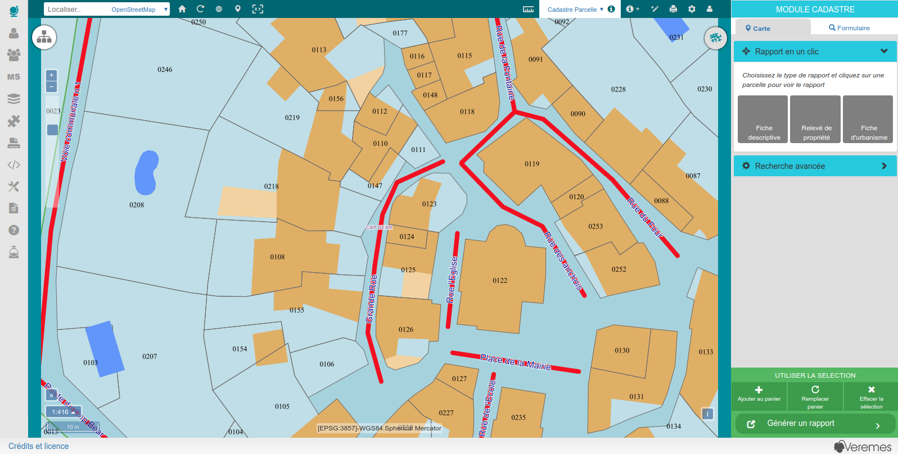

# Module Cadastre

Le module cadastre est un module spécifique à vMap intégré dans l'interface cartographique, le but du module est de rechercher soit cartographiquement soit de manière attributaire des entités cadastrales (parcelles, sections, bâtis etc..) dans le but de visualiser leurs informations et de générer des rapports spécifiques.

-   le bouton module cadastre   permet de déployer le module cadastre à droite de la carte.

